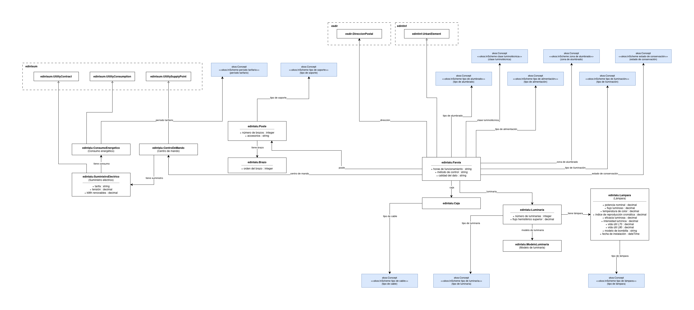

# Ontología de Alumbrado Público (Public Street Lighting Ontology)

Ontología para la representación de datos de alumbrado público en el contexto de la Federación Española de Municipios y Provincias (FEMP). Evolución de la ontología [OpenCityData](https://github.com/opencitydata/urbanismo-infraestructuras-alumbrado-publico) (v1.0-rc).

# Propósito y alcance de la ontología (Purpose and scope of the ontology)

El propósito de esta ontología es modelar los datos de alumbrado público publicados por entidades locales españolas, permitiendo:

- La publicación de inventarios de farolas como datos abiertos vinculados
- La auditoría energética del consumo eléctrico
- La evaluación del estado de conservación de las instalaciones

El alcance cubre: composición modular de farolas, infraestructura eléctrica, consumo energético, catálogo de modelos, parámetros fotométricos y contaminación lumínica.

# Prefijo y espacio de nombres (Prefix and namespace)

El prefijo de la ontología *Alumbrado Público* es: `edintalu` publicado bajo el espacio de nombres: [http://vocab.linkeddata.es/datosabiertos/def/urbanismo-infraestructuras/alumbrado-publico#](http://vocab.linkeddata.es/datosabiertos/def/urbanismo-infraestructuras/alumbrado-publico#)

# Modelo conceptual (Ontology conceptualization)

# Estructura del repositorio

| Carpeta | Descripción |
|--------|--------------|
| **diagrams/** | Almacena diagramas y otros recursos que representan el modelo conceptual de la ontología (e.g., jerarquías de clases, relaciones). |
| **documentation/** | Almacena la documentación HTML o dirigida a humanos de la ontología y artefactos relacionados. |
| **examples/** | Incluye ejemplos que demuestran cómo instanciar o aplicar la ontología en escenarios de datos reales. |
| **kos/** | Almacena vocabularios controlados o implementaciones KOS, generalmente implementaciones SKOS en rdf. |
| **ontology/** | Contiene los archivos de implementación de la ontología en formatos como `.owl`, `.rdf`, `.ttl`, o `.jsonld`. |
| **requirements/** | Contiene todos los documentos utilizados para definir los requisitos de la ontología: ejemplos de datos, preguntas de competencia, requisitos funcionales, casos de uso, etc. |
| **shapes/** | Contiene las formas SHACL utilizadas para definir y validar las restricciones de la ontología. |
| **tests/** | Contiene pruebas diseñadas para verificar que la ontología cumple con sus requisitos definidos. |
| **resources/** | Almacena recursos del proyecto como logotipos e imágenes. |

# Mantenimiento y evolución (Maintenance and evolution)

Para manejar las incidencias o mejoras sugeridas con respecto a la ontología, recomendamos seguir la guía proporcionada en [ISSUES.md](ISSUES.md) para generar una incidencia.

# Financiación (Funding)

Esta ontología ha sido desarrollada en el contexto del Espacio de Datos para las Infraestructuras Urbanas Inteligentes ([EDINT](https://edint.es)).

